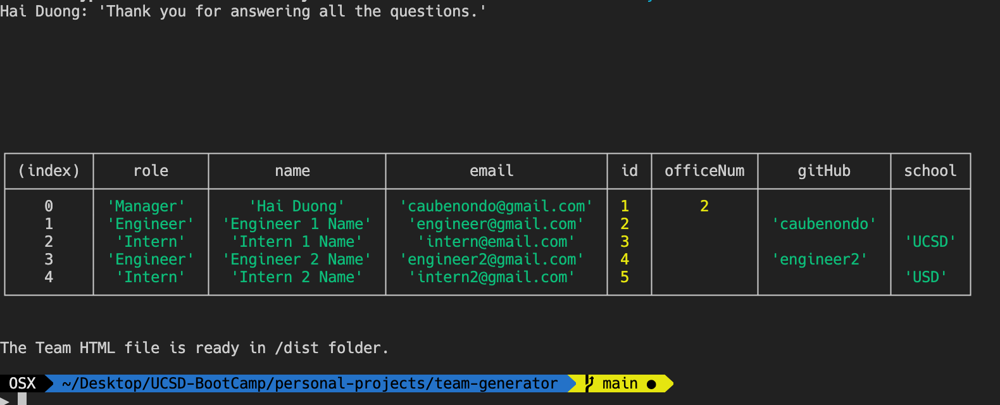
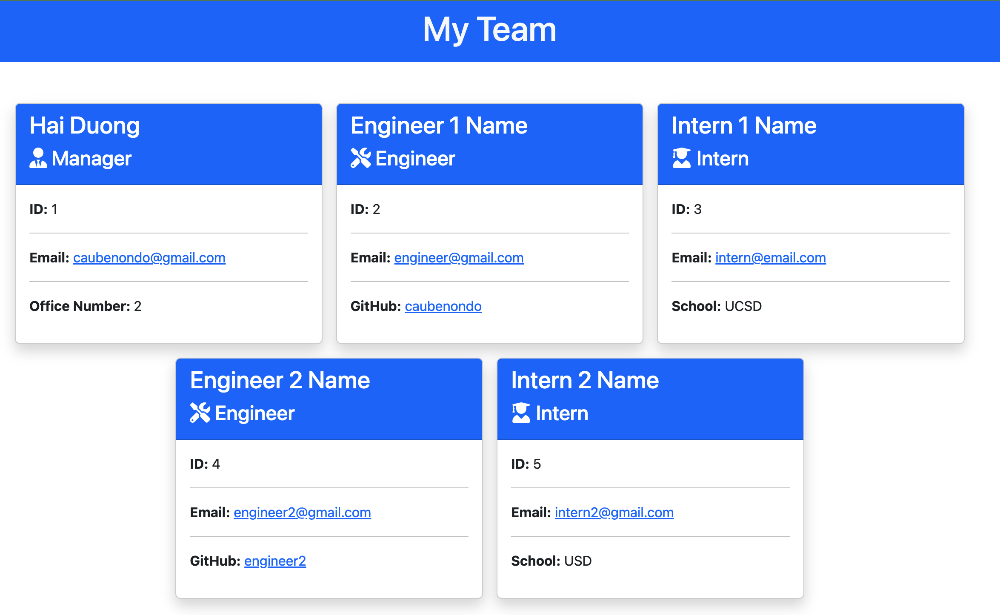

# Team HTML Generator

[](https://opensource.org/licenses/MIT)

## Description

This is a Node.js command-line application that takes in info about employees of a software team, then generates an HTML webpage that displays summaries for each person. The project implied OOP in Javascript and Unit Testing with Jest in a Test-Driven-Development fashion.

## Table of Contents

-   [Installation](#Installation)
-   [Start](#Start)
-   [Usage](#Usage)
-   [License](#License)
-   [Contributing](#Contributing)
-   [Tests](#Tests)
-   [App in Action](#Action)
-   [Questions](#Questions)

## Installation <a name='Installation'></a>

To install necessary dependencies, run the following command:

```
  npm i
```

## Start <a name='Start'></a>

To start the app, run this command:

```
  npm start
```

## Usage <a name='Usage'></a>

This repo is a solution for OOP module (weekly challenge) of UCSD coding bootcamp 2022.

## License <a name='License'></a>

The project is under [MIT](https://opensource.org/licenses/MIT) license.

## Contributing <a name='Contributing'></a>

It's only me writing this solution from the ground up. Also this, readme file is geneated from the previous weekly challenge.

## Tests <a name='Tests'></a>

To run tests, run the following command:

```
  npm test
```

## App in Action <a name='Action'></a>

Here is the Video Walkthrough of the App

[](https://youtu.be/DEmL64HK1Z4 "Team Generator HW challenge")

#### [Demo HTML](https://github.com/caubenondo/team-generator/blob/main/dist/index.html)

With these inputs

Final HTML


## Questions <a name='Questions'></a>

If you have any questions about the repo, open an issue or contact me directly at caubenondo@gmail.com.
You can find more of my work at [caubenondo](https://github.com/caubenondo)
